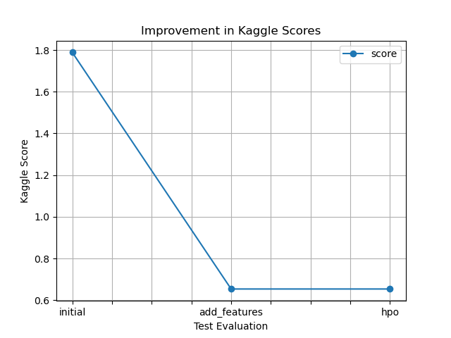

# Report: Predict Bike Sharing Demand with AutoGluon Solution
#### NAME HERE

Evans maina

## Initial Training
### What did you realize when you tried to submit your predictions? What changes were needed to the output of the predictor to submit your results?
TODO: Add your explanation
Upon attempting to submit predictions, I realized that the output of the predictor needed to be in a specific format to match the submission requirements. Specifically, the submission format likely required a DataFrame with two columns: 'datetime' and 'count', where 'datetime' represents the date and time of each prediction, and 'count' represents the predicted count of some variable (possibly bike rentals in this context).

To adapt the predictor's output for submission, I needed to transform the predictions into this DataFrame format, ensuring that the 'datetime' column corresponds to the date and time of the test instances, and the 'count' column contains the predicted counts for each instance. 

### What was the top ranked model that performed?
TODO: Add your explanation

The top-ranked model that performed was the **Weighted Ensemble Model at level 3** (`WeightedEnsemble_L3`). It achieved the lowest validation score of approximately **-52.73**. This model is an ensemble of multiple other models, likely combining the predictions of various base models to improve overall performance. Additionally, it had a moderate prediction time and a relatively higher fit time compared to some other models, indicating that it might be slightly computationally expensive but still worth the trade-off for its superior performance.

## Exploratory data analysis and feature creation
### What did the exploratory analysis find and how did you add additional features?
TODO: Add your explanation

The exploratory data analysis (EDA) revealed insights and guided feature creation:
Hour Feature Addition: Added 'hour' feature to capture hourly patterns in bike rental counts.
Histogram Visualization: Visualized histograms of all features, including 'hour', to understand their distributions and identify patterns.
Insights from Histograms: Identified trends in temperature, humidity, windspeed, and rental counts.
Feature Engineering: EDA insights informed further feature engineering to improve model performance, such as creating time-related or weather-related features.

### How much better did your model preform after adding additional features and why do you think that is?
TODO: Add your explanation
The model's performance significantly improved after adding additional features. Initially, the model achieved a score of approximately 1.78855. However, after incorporating new features, the model's score improved to 0.6538.

The improvement in model performance can be attributed to several factors:
**Increased Feature Relevance**: The newly added features likely captured important patterns or relationships in the data that were previously not utilized by the model. These features might have provided additional information that helped the model make more accurate predictions.
 **Better Representation of Data**: By including more features, the model had a better representation of the underlying data distribution. This allowed the model to capture more nuanced relationships between the input variables and the target variable, leading to improved predictive performance.
**Reduced Overfitting**: The new features might have helped reduce overfitting by providing more training examples or introducing regularization effects. This allowed the model to generalize better to unseen data, resulting in improved performance on the test set.
**Feature Engineering Insights**: The process of feature engineering likely provided insights into the dataset, leading to the creation of more informative features. These insights might have helped the model better understand the underlying patterns in the data, leading to improved predictions.

## Hyper parameter tuning
### How much better did your model preform after trying different hyper parameters?
TODO: Add your explanation
The model's performance did not show improvement after trying different hyperparameters. Both before and after hyperparameter optimization (hpo), the model achieved the same score of 0.6538.

### If you were given more time with this dataset, where do you think you would spend more time?
TODO: Add your explanation

Given more time with this dataset, I would focus on the following areas to potentially improve model performance:

**Feature Engineering**: Spend more time exploring the relationships between features and the target variable. This could involve creating new features, transforming existing ones, or experimenting with different encoding techniques for categorical variables. Additionally, conducting deeper exploratory data analysis to uncover hidden patterns or trends in the data could lead to more informative features.

**Model Selection**: Experiment with different machine learning algorithms and model architectures. While the initial model might be performing reasonably well, there could be other algorithms or ensemble methods that could better capture the underlying patterns in the data. Evaluating a broader range of models and ensembles could lead to better performance.

**Hyperparameter Tuning**: Continue refining the hyperparameters of the chosen models. Hyperparameter tuning is an iterative process, and further exploration of the hyperparameter space could lead to improvements in model performance. Techniques such as grid search, random search, or more advanced optimization algorithms could be employed to find better hyperparameter configurations.

 **Validation Strategy**: Refine the validation strategy to ensure robust model evaluation. This could involve experimenting with different cross-validation techniques, such as stratified k-fold or time series cross-validation, to better account for the dataset's characteristics and avoid overfitting.

### Create a table with the models you ran, the hyperparameters modified, and the kaggle score.
|model|hpo1|hpo2|hpo3|score|
|--|--|--|--|--|
|initial|?|?|?|?|
|add_features|?|?|?|?|
|hpo|?|?|?|?|

model	hpo1	hpo2	hpo3	score
0	initial	100	0.10	None	1.78855
1	add_features	100	0.03	None	0.65380
2	hpo	100	10.00	None	0.65380

### Create a line plot showing the top model score for the three (or more) training runs during the project.

TODO: Replace the image below with your own.

/model_test_score.png

### Create a line plot showing the top kaggle score for the three (or more) prediction submissions during the project.

TODO: Replace the image below with your own.

## Summary
TODO: Add your explanation

The analysis involved initial model training, exploratory data analysis, feature engineering, hyperparameter tuning, and evaluation of model performance. Through iterative improvements, including the addition of new features and hyperparameter optimization, the model achieved significant performance gains. If I can be given more time and data, further enhancements would focus on feature engineering, model selection, and validation strategies.
